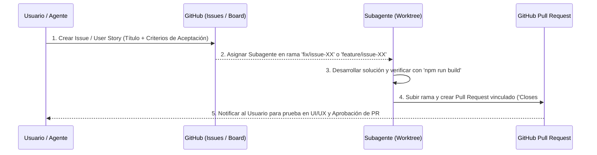

# IRON TRACKER - Automated Issue & Bugfix Workflow

Esta habilidad estandariza el flujo automatizado desde la detección de un Bug/User Story hasta su resolución mediante Pull Request.

---

## 🔄 Flujo Automatizado de 5 Pasos



---

## 📋 Protocolo Obligatorio del Agente

### Paso 1: Registrar el Issue en GitHub
Antes de escribir una sola línea de código, el agente debe registrar el **GitHub Issue** (vía API/CLI o script) con la siguiente estructura:
- **Título**: `[BUG] Descripción concisa` o `[FEATURE] Descripción concisa`
- **Descripción**:
  - Comportamiento actual vs Comportamiento esperado.
  - Pasos para reproducir.
  - Criterios de Aceptación.

### Paso 2: Invocar al Subagente en Git Worktree
El agente principal invoca un subagente dedicado en un workspace aislado (`Workspace: 'share'`):
- Nombre de la rama: `fix/issue-{ID}-{nombre-corto}` o `feature/issue-{ID}-{nombre-corto}`.

### Paso 3: Ejecución y Build Check
El subagente realiza los cambios y ejecuta obligatoriamente:
```bash
npm run build
```

### Paso 4: Creación de Pull Request
El subagente sube la rama y genera el **Pull Request (PR)** incluyendo en la descripción:
`Closes #{ID_DEL_ISSUE}`.

### Paso 5: Entrega al Usuario
El agente notifica al usuario con el enlace directo del PR y del Issue para su revisión visual y aprobación.
